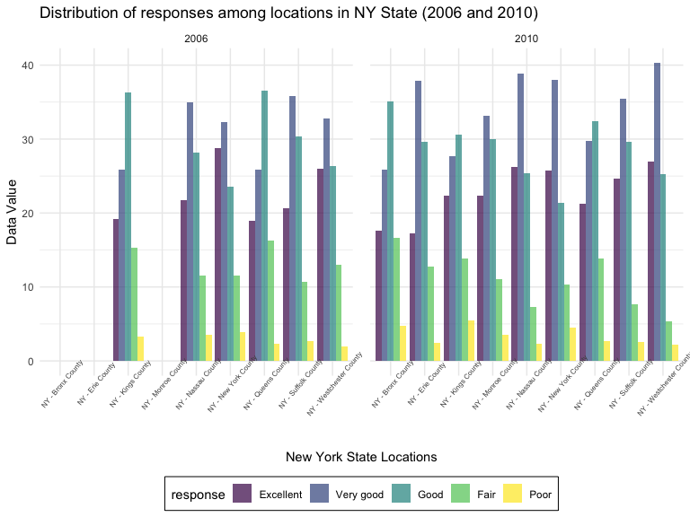
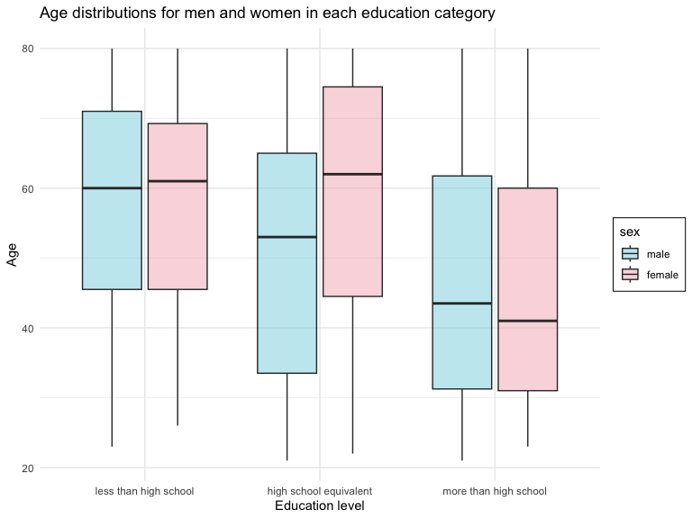
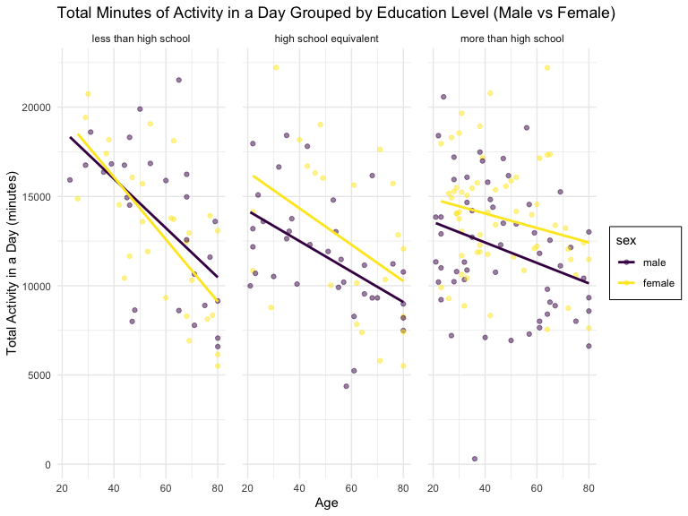

p8105_hw3_wz2630
================

``` r
library(tidyverse)
library(ggridges)
library(patchwork)

#extra color palette:
library(wesanderson)

# library with datasets used in this homework
library(p8105.datasets)

# figure settings
knitr::opts_chunk$set(
    echo = TRUE,
    warning = FALSE,
    fig.width = 8, 
  fig.height = 6,
  out.width = "90%"
)

theme_set(theme_minimal() + theme(legend.position = "bottom"))

options(
  ggplot2.continuous.colour = "viridis",
  ggplot2.continuous.fill = "viridis"
)

scale_colour_discrete = scale_colour_viridis_d
scale_fill_discrete = scale_fill_viridis_d
```

## Problem 1

``` r
data("instacart")
```

There are 1,384,617 observations and 15 variables in the ‘instacart’
dataset. 4 of 15 are character data type and the remaining is integer
data type. Key variables include order_id, product_id, user_id,
product_name, aisle_id, department_id, not including all.

``` r
# How many aisles are there, and which aisles are the most items ordered from?
aisle_count = 
  instacart |> 
  count(aisle) |> 
  arrange(desc(n))
```

There are 134 aisles. Fresh vegetables (aisle_id = 83) and fresh fruits
(aisle_id = 24) have the most items ordered. Fresh vegetables aisle have
150,609 items ordered and fresh fruits aisle have 150,473 items ordered.

``` r
# Make a plot that shows the number of items ordered in each aisle, limiting this to aisles with more than 10000 items ordered. Arrange aisles sensibly, and organize your plot so others can read it.

instacart |> 
  count(aisle) |> 
  filter(n > 10000) |> 
  mutate(aisle = fct_reorder(aisle, n)) |> #fct_reorder turns aisle into factor variables based on count, n
  ggplot(aes(x = aisle, y = n)) + 
  geom_point() + 
  labs(title = "Number of items ordered in each aisle") + 
  theme(axis.text.x = element_text(angle = 60, hjust = 1, color = "navy"))
```


``` r
# Make a table showing the three most popular items in each of the aisles “baking ingredients”, “dog food care”, and “packaged vegetables fruits”. Include the number of times each item is ordered in your table

instacart |> 
  filter(aisle %in% c("baking ingredients", "dog food care", "packaged vegetables fruits")) |>
  group_by(aisle) |> 
  count(product_name) |> 
  mutate(rank = min_rank(desc(n))) |> 
  # min_rank gives the same rank to ties based on product_names we counted; ranking function
  filter(rank < 4) |> 
  # we want top 3 products
  arrange(desc(n)) |>
  knitr::kable() # returns a table
```

| aisle                      | product_name                                  |    n | rank |
|:---------------------------|:----------------------------------------------|-----:|-----:|
| packaged vegetables fruits | Organic Baby Spinach                          | 9784 |    1 |
| packaged vegetables fruits | Organic Raspberries                           | 5546 |    2 |
| packaged vegetables fruits | Organic Blueberries                           | 4966 |    3 |
| baking ingredients         | Light Brown Sugar                             |  499 |    1 |
| baking ingredients         | Pure Baking Soda                              |  387 |    2 |
| baking ingredients         | Cane Sugar                                    |  336 |    3 |
| dog food care              | Snack Sticks Chicken & Rice Recipe Dog Treats |   30 |    1 |
| dog food care              | Organix Chicken & Brown Rice Recipe           |   28 |    2 |
| dog food care              | Small Dog Biscuits                            |   26 |    3 |

``` r
# Make a table showing the mean hour of the day at which Pink Lady Apples and Coffee Ice Cream are ordered on each day of the week; format this table for human readers (i.e. produce a 2 x 7 table)

instacart |>
  filter(product_name %in% c("Pink Lady Apples", "Coffee Ice Cream")) |>
  group_by(product_name, order_dow) |> 
  summarise(mean_hour = mean(order_hour_of_day)) |> 
  pivot_wider(
    names_from = order_dow,
    values_from = mean_hour) |> 
  knitr::kable(digits = 2)
```

    ## `summarise()` has grouped output by 'product_name'. You can override using the
    ## `.groups` argument.

| product_name     |     0 |     1 |     2 |     3 |     4 |     5 |     6 |
|:-----------------|------:|------:|------:|------:|------:|------:|------:|
| Coffee Ice Cream | 13.77 | 14.32 | 15.38 | 15.32 | 15.22 | 12.26 | 13.83 |
| Pink Lady Apples | 13.44 | 11.36 | 11.70 | 14.25 | 11.55 | 12.78 | 11.94 |

## Problem 2

``` r
data("brfss_smart2010")
```

Data cleaning

``` r
brfss = 
  brfss_smart2010 |> 
  janitor::clean_names() |> 
  filter(response %in% c("Excellent", "Very good", "Good", "Fair", "Poor"), topic == "Overall Health") |> 
  mutate(response = factor(response, 
                           levels = c("Excellent", "Very good", "Good", "Fair", "Poor", ordered = TRUE)))
```

In 2002, which states were observed at 7 or more locations? What about
in 2010?

``` r
brfss |> 
  filter(year == 2002) |> 
  group_by(locationabbr) |> 
  summarise(locations_count = n_distinct(locationdesc)) |> 
  filter(locations_count >= 7)
```

    ## # A tibble: 6 × 2
    ##   locationabbr locations_count
    ##   <chr>                  <int>
    ## 1 CT                         7
    ## 2 FL                         7
    ## 3 MA                         8
    ## 4 NC                         7
    ## 5 NJ                         8
    ## 6 PA                        10

``` r
brfss |> 
  filter(year == 2010) |> 
  group_by(locationabbr) |> 
  summarise(locations_count = n_distinct(locationdesc)) |> 
  filter(locations_count >= 7)
```

    ## # A tibble: 14 × 2
    ##    locationabbr locations_count
    ##    <chr>                  <int>
    ##  1 CA                        12
    ##  2 CO                         7
    ##  3 FL                        41
    ##  4 MA                         9
    ##  5 MD                        12
    ##  6 NC                        12
    ##  7 NE                        10
    ##  8 NJ                        19
    ##  9 NY                         9
    ## 10 OH                         8
    ## 11 PA                         7
    ## 12 SC                         7
    ## 13 TX                        16
    ## 14 WA                        10

**Comments:**

In 2002, **6** states were observed at 7 or more locations. Those states
are **CT, FL, MA, NC, NJ, PA**.

In 2010, **14** states were observed at 7 or more locations. Those
states are **CA, CO, FL, MA, MD, NC, NE, NJ, NY, OH, PA, SC, TX, WA**.

Construct a dataset that is limited to Excellent responses, and
contains, year, state, and a variable that averages the data_value
across locations within a state. Make a “spaghetti” plot of this average
value over time within a state (that is, make a plot showing a line for
each state across years – the geom_line geometry and group aesthetic
will help).

``` r
excellent_responses = 
  brfss |> 
  filter(response == "Excellent") |>
  group_by(year, locationabbr) |> 
  summarise(data_value_avg = mean(data_value))
```

    ## `summarise()` has grouped output by 'year'. You can override using the
    ## `.groups` argument.

``` r
# spaghetti plot:
excellent_responses |> 
  rename("State" = locationabbr) |> 
  ggplot(aes(x = year, y = data_value_avg, color = State)) + 
  geom_line(alpha = .5) +
  geom_point() + 
  labs(x = "Year", 
       y = "Average Data Values", 
       title = "Average Data Values From 2002 to 2020 for Each State") + 
  theme(legend.position = "right",
        legend.box.background = element_rect())
```


**Comments:**

The spaghetti plots of these “Excellent” ratings across 50 states and 1
US district shows that there is great variance and is difficult to
identify a trend. However, it is shown that there is a dense overlap of
average data values from 20-24. There is no notable difference in this
observation across the years 2002-2010.

Make a two-panel plot showing, for the years 2006, and 2010,
distribution of data_value for responses (“Poor” to “Excellent”) among
locations in NY State

``` r
brfss |> 
  filter(year %in% c(2006, 2010), locationabbr == "NY") |> 
  ggplot(aes(x = locationdesc, y = data_value, fill = response)) +
  geom_bar(position="dodge", stat="identity", alpha = 0.7) + 
  facet_wrap(~year) + 
  labs(x = "New York State Locations", 
       y = "Data Value",
       title = "Distribution of responses among locations in NY State (2006 and 2010)") + 
  theme(legend.position = "bottom",
        legend.box.background = element_rect(),
        panel.spacing = unit(1, "lines"),
        axis.text.x = element_text(angle = 50, size = 6))
```


**Comments:**

2006 and 2020 had relatively similar rating distributions. In both
years, “Poor” had the lowest data value and “Very good” had the highest
data value. Both “Poor” and Fair” data value distributions(IQR) widened
in 2010. In 2006, There were no data value distributions for NY
locations, Bronx, Erie, and Monroe Counties.

## Problem 3

load data and clean

``` r
covar = 
  read_csv(file = "./data/nhanes_covar.csv",
           skip = 4) |> 
  janitor::clean_names() |> 
  filter(age >= 21) |> 
  drop_na()
```

    ## Rows: 250 Columns: 5
    ## ── Column specification ────────────────────────────────────────────────────────
    ## Delimiter: ","
    ## dbl (5): SEQN, sex, age, BMI, education
    ## 
    ## ℹ Use `spec()` to retrieve the full column specification for this data.
    ## ℹ Specify the column types or set `show_col_types = FALSE` to quiet this message.

``` r
accel = 
  read_csv(file = "./data/nhanes_accel.csv") |> 
  janitor::clean_names()
```

    ## Rows: 250 Columns: 1441
    ## ── Column specification ────────────────────────────────────────────────────────
    ## Delimiter: ","
    ## dbl (1441): SEQN, min1, min2, min3, min4, min5, min6, min7, min8, min9, min1...
    ## 
    ## ℹ Use `spec()` to retrieve the full column specification for this data.
    ## ℹ Specify the column types or set `show_col_types = FALSE` to quiet this message.

Merge demographic and accelerometer datasets

``` r
nhanes = 
  inner_join(covar, accel, by = "seqn")
```

Factor variables and rename

``` r
nhanes$sex = factor(nhanes$sex, 
                                  levels = c("1", "2"),
                                  labels = c("male", "female"))

nhanes$education = factor(nhanes$education, 
                                  levels = c("1", "2", "3"),
                                  labels = c("less than high school", "high school equivalent", "more than high school"))
```

Encode data with reasonable variable classes

``` r
nhanes$seqn = as.integer(nhanes$seqn)
nhanes$age = as.integer(nhanes$age)
nhanes$bmi = as.integer(nhanes$bmi)
```

Produce a reader-friendly table for the number of men and women in each
education category, and create a visualization of the age distributions
for men and women in each education category. Comment on these items.

Table of number of men and women in each education category

``` r
nhanes |> 
  group_by(sex, education) |> 
  summarize(count = n()) |> 
  pivot_wider(names_from = education, values_from = count) |> 
  knitr::kable(digits = 1)
```

    ## `summarise()` has grouped output by 'sex'. You can override using the `.groups`
    ## argument.

| sex    | less than high school | high school equivalent | more than high school |
|:-------|----------------------:|-----------------------:|----------------------:|
| male   |                    27 |                     35 |                    56 |
| female |                    28 |                     23 |                    59 |

**Comments:** The table shows that there are about the same number of
males(27) and females(28) in the “less than high school” category. There
are more males(35) than females(23) in the “high school equivalent”
category. There are also about the same male(56) and female(59) in the
“more than high school” education category.

A visualization of the age distributions for men and women in each
education category

``` r
nhanes |> 
  ggplot(aes(x = education, y = age, fill = sex)) +
  geom_boxplot(alpha = 0.50) +
  labs(x = "Education level",
       y = "Age",
       title = "Age distributions for men and women in each education category") +
  theme(legend.position = "right",
        legend.box.background = element_rect()) + #gives legend a box
  scale_fill_manual(values = wes_palette("Moonrise3", n = 2)) #extra: changes color of bp
```


**Comments:**

Based on the boxplots, we can see that the age distributions for “less
than high school” and “more than high school” categories are similar
when compared between male and females in their respective groups.
However, the age distributions for “high school equivalent” category are
quite different between male and females; males with “high school
equivalent” are younger than females overall from the same category.
Males and Females in the “more than high school” category are on average
younger.

Using your tidied dataset, aggregate across minutes to create a total
activity variable for each participant. Plot these total activities
(y-axis) against age (x-axis); your plot should compare men to women and
have separate panels for each education level. Include a trend line or a
smooth to illustrate differences. Comment on your plot.

``` r
# create new variable
nhanes_total <-
  nhanes |> 
    mutate(total_activity = rowSums(across(min1:min1440), na.rm = TRUE))

# make plots
nhanes_total |> 
ggplot(aes(x = age, y = total_activity, color = sex)) + 
  geom_point(alpha = 0.5, size = 1.5) + 
  geom_smooth(method = lm, se = FALSE) + 
  facet_wrap(~education) + 
  labs(x = "Age",
       y = "Total Activity in a Day (minutes)",
       title = "Total Minutes of Activity in a Day Grouped by Education Level (Male vs Female)") +
  theme(legend.position = "right",
        legend.box.background = element_rect(),
        panel.spacing = unit(1, "lines"))
```

    ## `geom_smooth()` using formula = 'y ~ x'


**Comments:**

Overall, there is a negative association between age and total physical
activity across all three education levels. There is a decreased amount
of physical activity in a day as age increases. The “less than high
school” education level presents a larger difference in amount of
physical activity as age increases. Females tend to have more physical
activity for both “high school equivalent” and “more than high school”
education levels.

Accelerometer data allows the inspection activity over the course of the
day. Make a three-panel plot that shows the 24-hour activity time
courses for each education level and use color to indicate sex.

``` r
# first we want to pivot the observation so each minute is its own observation and we can plot these xalues as x
nhanes_pivotlonger <-
  nhanes |> 
  pivot_longer(cols = starts_with("min"), 
               names_to = "minute", #turned "min_" into a minute column
               values_to = "activity") |>   #turned all the time values to activity column
  mutate(minute = as.integer(gsub("min", "", minute))) #convert minute into an integer variable

nhanes_pivotlonger |> 
  ggplot(aes(x = minute, y = activity, color = sex)) +
  geom_line(alpha = 0.2, size = 0.5) + 
  geom_smooth(aes(group = sex), se = FALSE) + 
  facet_wrap(~education, ncol = 1) + 
  labs(y = "Activity time (minutes)",
       title = "24-hour Activity by Education Level and Gender") + 
  theme(legend.position = "right",
        legend.box.background = element_rect(),
        panel.spacing = unit(1, "lines")) +
  scale_x_continuous(name = "Hour", breaks = seq(0, 1440, 60), labels = 0:24) # marks every 60 minutes as one hour 
```

    ## `geom_smooth()` using method = 'gam' and formula = 'y ~ s(x, bs = "cs")'


**Comments:**

A line is plotted for each individual throughout a 24-hour time period
in minutes to track their physical activity time – 1 hour is marked for
every 60 minutes for practicality. A trendline is laid over to identify
the general trend.

Based on the graphs, there is a slightly higher amount of physical
activity among female compared to males. It is difficult to to tell if
there is a notable difference in physical activity among the education
levels. However, we can see that at around the 5 hours in, physical
activity begins to increase for both genders and across all education
levels.
