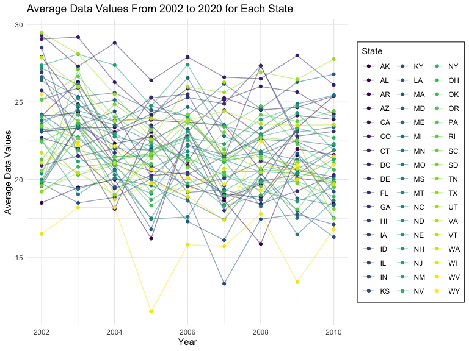

p8105_hw3_wz2630
================

``` r
library(tidyverse)
library(ggridges)
library(patchwork)

# library with datasets used in this homework
library(p8105.datasets)

# figure settings
knitr::opts_chunk$set(
    echo = TRUE,
    warning = FALSE,
    fig.width = 8, 
  fig.height = 6,
  out.width = "90%"
)

theme_set(theme_minimal() + theme(legend.position = "bottom"))

options(
  ggplot2.continuous.colour = "viridis",
  ggplot2.continuous.fill = "viridis"
)

scale_colour_discrete = scale_colour_viridis_d
scale_fill_discrete = scale_fill_viridis_d
```

## Problem 1

``` r
data("instacart")
```

There are 1,384,617 observations and 15 variables in the ‘instacart’
dataset. 4 of 15 are character data type and the remaining is integer
data type. Key variables include order_id, product_id, user_id,
product_name, aisle_id, department_id, not including all. \# what are
illustrative examples?

``` r
# How many aisles are there, and which aisles are the most items ordered from?
aisle_count = 
  instacart |> 
  count(aisle) |> 
  arrange(desc(n))
```

There are 134 aisles. Fresh vegetables (aisle_id = 83) and fresh fruits
(aisle_id = 24) have the most items ordered. Fresh vegetables aisle have
150,609 items ordered and fresh fruits aisle have 150,473 items ordered.

``` r
# Make a plot that shows the number of items ordered in each aisle, limiting this to aisles with more than 10000 items ordered. Arrange aisles sensibly, and organize your plot so others can read it.

instacart |> 
  count(aisle) |> 
  filter(n > 10000) |> 
  mutate(aisle = fct_reorder(aisle, n)) |> #fct_reorder turns aisle into factor variables based on count, n
  ggplot(aes(x = aisle, y = n)) + 
  geom_point() + 
  labs(title = "Number of items ordered in each aisle") + 
  theme(axis.text.x = element_text(angle = 60, hjust = 1, color = "navy"))
```


``` r
# Make a table showing the three most popular items in each of the aisles “baking ingredients”, “dog food care”, and “packaged vegetables fruits”. Include the number of times each item is ordered in your table

instacart |> 
  filter(aisle %in% c("baking ingredients", "dog food care", "packaged vegetables fruits")) |>
  group_by(aisle) |> 
  count(product_name) |> 
  mutate(rank = min_rank(desc(n))) |> 
  # min_rank gives the same rank to ties based on product_names we counted; ranking function
  filter(rank < 4) |> 
  # we want top 3 products
  arrange(desc(n)) |>
  knitr::kable() # returns a table
```

| aisle                      | product_name                                  |    n | rank |
|:---------------------------|:----------------------------------------------|-----:|-----:|
| packaged vegetables fruits | Organic Baby Spinach                          | 9784 |    1 |
| packaged vegetables fruits | Organic Raspberries                           | 5546 |    2 |
| packaged vegetables fruits | Organic Blueberries                           | 4966 |    3 |
| baking ingredients         | Light Brown Sugar                             |  499 |    1 |
| baking ingredients         | Pure Baking Soda                              |  387 |    2 |
| baking ingredients         | Cane Sugar                                    |  336 |    3 |
| dog food care              | Snack Sticks Chicken & Rice Recipe Dog Treats |   30 |    1 |
| dog food care              | Organix Chicken & Brown Rice Recipe           |   28 |    2 |
| dog food care              | Small Dog Biscuits                            |   26 |    3 |

``` r
# Make a table showing the mean hour of the day at which Pink Lady Apples and Coffee Ice Cream are ordered on each day of the week; format this table for human readers (i.e. produce a 2 x 7 table)

instacart |>
  filter(product_name %in% c("Pink Lady Apples", "Coffee Ice Cream")) |>
  group_by(product_name, order_dow) |> 
  summarise(mean_hour = mean(order_hour_of_day)) |> 
  pivot_wider(
    names_from = order_dow,
    values_from = mean_hour) |> 
  knitr::kable(digits = 2)
```

    ## `summarise()` has grouped output by 'product_name'. You can override using the
    ## `.groups` argument.

| product_name     |     0 |     1 |     2 |     3 |     4 |     5 |     6 |
|:-----------------|------:|------:|------:|------:|------:|------:|------:|
| Coffee Ice Cream | 13.77 | 14.32 | 15.38 | 15.32 | 15.22 | 12.26 | 13.83 |
| Pink Lady Apples | 13.44 | 11.36 | 11.70 | 14.25 | 11.55 | 12.78 | 11.94 |

## Problem 2

``` r
data("brfss_smart2010")
```

Data cleaning

``` r
brfss = 
  brfss_smart2010 |> 
  janitor::clean_names() |> 
  filter(response %in% c("Excellent", "Very good", "Good", "Fair", "Poor"), topic == "Overall Health") |> 
  mutate(response = factor(response, 
                           levels = c("Excellent", "Very good", "Good", "Fair", "Poor", ordered = TRUE)))
```

In 2002, which states were observed at 7 or more locations? What about
in 2010?

``` r
brfss |> 
  filter(year == 2002) |> 
  group_by(locationabbr) |> 
  summarise(locations_count = n_distinct(locationdesc)) |> 
  filter(locations_count >= 7)
```

    ## # A tibble: 6 × 2
    ##   locationabbr locations_count
    ##   <chr>                  <int>
    ## 1 CT                         7
    ## 2 FL                         7
    ## 3 MA                         8
    ## 4 NC                         7
    ## 5 NJ                         8
    ## 6 PA                        10

``` r
brfss |> 
  filter(year == 2010) |> 
  group_by(locationabbr) |> 
  summarise(locations_count = n_distinct(locationdesc)) |> 
  filter(locations_count >= 7)
```

    ## # A tibble: 14 × 2
    ##    locationabbr locations_count
    ##    <chr>                  <int>
    ##  1 CA                        12
    ##  2 CO                         7
    ##  3 FL                        41
    ##  4 MA                         9
    ##  5 MD                        12
    ##  6 NC                        12
    ##  7 NE                        10
    ##  8 NJ                        19
    ##  9 NY                         9
    ## 10 OH                         8
    ## 11 PA                         7
    ## 12 SC                         7
    ## 13 TX                        16
    ## 14 WA                        10

In 2002, **6** states were observed at 7 or more locations. Those states
are **CT, FL, MA, NC, NJ, PA**.

In 2010, **14** states were observed at 7 or more locations. Those
states are **CA, CO, FL, MA, MD, NC, NE, NJ, NY, OH, PA, SC, TX, WA**.

Construct a dataset that is limited to Excellent responses, and
contains, year, state, and a variable that averages the data_value
across locations within a state. Make a “spaghetti” plot of this average
value over time within a state (that is, make a plot showing a line for
each state across years – the geom_line geometry and group aesthetic
will help).

``` r
excellent_responses = 
  brfss |> 
  filter(response == "Excellent") |>
  group_by(year, locationabbr) |> 
  summarise(data_value_avg = mean(data_value))
```

    ## `summarise()` has grouped output by 'year'. You can override using the
    ## `.groups` argument.

``` r
# spaghetti plot:
excellent_responses |> 
  rename("State" = locationabbr) |> 
  ggplot(aes(x = year, y = data_value_avg, color = State)) + 
  geom_line(alpha = .5) +
  geom_point() + 
  labs(x = "Year", 
       y = "Average Data Values", 
       title = "Average data values across years for each state") + 
  theme(legend.position = "right")
```



Make a two-panel plot showing, for the years 2006, and 2010,
distribution of data_value for responses (“Poor” to “Excellent”) among
locations in NY State

two_panel_plot = brfss \|\> filter(year %in% c(2006, 2010)) \|\>
pivot_longer( Poor:Excellent, names_to = “state”, values_to =
“repsonse”) \|\> ggplot(aes(x = year, y = response, color = response)) +
geom_boxplot() + facet_grid(.~year)

## Problem 3
